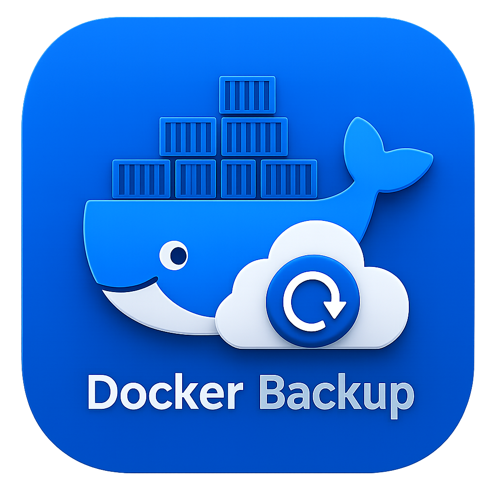

<p align="center">
  
</p>

<h1 align="center">DockerBackup</h1>

<p align="center">
  <em>Backup e restauração de containers Docker via interface web, com suporte a snapshots incrementais e restore seletivo.</em>
</p>

<p align="center">
  
  
  
  
  
</p>

> ⚠️ **AVISO CRÍTICO:** Aplicação em estágio inicial de desenvolvimento. Não use em produção — há risco de perda de dados.

Versão atual: **0.2.2**

---

## 📋 Changelog

### [0.2.2] — 2026-05-12

#### Corrigido
- **Volumes de container remoto:** ao clicar em um container para selecionar volumes no modal de criação de perfil, a busca de mounts agora utiliza a conexão correta (TCP remoto) quando a origem selecionada é uma conexão Docker remota (porta 2375), corrigindo o erro `ENOENT /var/run/docker.sock` que ocorria ao usar origens remotas.
- **Agrupamento por Docker Compose na lista de containers:** containers do modal de criação de profile agora são agrupados visualmente por projeto Compose, com cabeçalho identificando o stack. Containers sem Compose aparecem em grupo separado "Containers avulsos".

---

### [0.2.1] — 2026-05-12

#### Adicionado
- **Novos tipos de Storage Location:** além do armazenamento local, agora é possível cadastrar destinos remotos: **FTP**, **SFTP**, **WebDAV** e **Google Drive**.
- **Campos dinâmicos por tipo de storage:** o modal de criação/edição de Storage Location exibe apenas os campos relevantes ao tipo selecionado (host, porta, usuário, senha, caminho remoto, modo passivo, chave privada SSH, URL WebDAV, credenciais OAuth Google Drive).
- **Badge de tipo na listagem:** cada Storage Location exibe um badge colorido com seu tipo (Local, FTP, SFTP, WebDAV, Google Drive) e o endereço de destino na tabela.
- **Dropdown de profile atualizado:** o seletor de Storage Location nos Backup Profiles passa a exibir o tipo de cada location junto ao nome.

---

### [0.2.0] — 2026-05-11

#### Adicionado
- **Aba Source (Origens):** nova aba acima de Storage Locations para gerenciar origens de conexão Docker, com suporte a Unix socket, conexão direta (TCP porta 2375) e Docker Agent
- **Cascade de exclusão de source:** ao remover uma origem, todos os profiles e backups associados são automaticamente removidos
- **Seleção de source no profile:** cada backup profile pode ser vinculado a uma origem Docker específica
### [0.1.6] — 2026-05-11

#### Corrigido
- Contagem de arquivos totais antes do inicio do backup para todos os escopos (container inteiro e volumes), corrigindo a barra de progresso que mostrava 0 no total
- Container alvo agora e parado antes do backup de volumes e reiniciado apos conclusao, evitando inconsistencias nos dados arquivados

### [0.1.5] — 2026-05-10

#### Adicionado
- **Botão `Log` na aba Backup Runs:** cada run exibe agora um botão que abre um modal com o log completo do backup por container, incluindo saída do tar, avisos e erros ocorridos durante a execução.
- **Endpoint `GET /api/backups/:backupId`:** novo endpoint que retorna os dados completos de um backup (incluindo logs) a partir do seu ID.
- **Logs persistidos por container no backup:** o array de logs gerado durante o backup (`pushLog`) é agora salvo em `containerBackup.logs` e persistido no `store.json`, disponível para consulta posterior.

#### Melhorado
- **Dropdowns estilizados como campos de texto:** todos os elementos `<select>` dentro de `.form-field` e o `.settings-select` passaram a usar o mesmo estilo visual dos inputs de texto (borda, padding, tipografia), com ícone de seta customizado via SVG.
- **Tela Sobre — posição do autor:** o texto `Desenvolvido por Alexander Sabino em 2026` foi movido para logo abaixo da descrição da aplicação.
- **Tela Sobre — changelog limitado:** a seção de changelog exibe agora apenas as últimas 4 entradas de versão.

### [0.1.4] — 2026-05-09

#### Corrigido
- **Restore incremental não apagava arquivos deletados entre backups:** `tar -xzf` sem `--listed-incremental` não honra informações de deleção embutidas no archive incremental. Corrigido: archives com `mode === 'incremental'` agora são extraídos com `tar --listed-incremental=/dev/null -xzvf`, que instrui o tar a ler o snapshot embutido e remover arquivos que foram deletados entre o backup anterior e o incremental. O archive full continua usando extração simples.
- **Estatísticas do restore sempre zeradas:** o objeto `restoreStats` era criado mas nunca preenchido. Corrigido: o comando `tar` passou a usar o flag `-v` (verbose), que imprime cada arquivo extraído no stdout; o callback `onOutput` agora recebe o parâmetro `streamName` e incrementa `restoreStats.created` a cada linha do stdout, resultando no total real de arquivos restaurados no toast de conclusão.
- **Path não-nativo (fora do Docker) referenciava `restorePaths` indefinido:** a variável `restorePaths` era usada no filtro de mounts do path não-nativo sem ter sido declarada nesse escopo. Corrigido: o path não-nativo agora computa `restorePathsNonNative` a partir de `chain[0].backupPaths` (igual à lógica do path nativo).

### [0.1.3] — 2026-05-09

#### Corrigido
- **Restore incremental não aplicava o archive incremental (bug crítico):** o `tar` frequentemente retorna código de saída `1` durante a extração em volumes (avisos de permissão/ownership que não são erros fatais). Como o script do helper era gerado com `set -e` e comandos encadeados por `&&`, qualquer exit code `1` do archive full abortava a cadeia antes de aplicar os archives incrementais. Corrigido: removido `set -e` e a junção por `&&`; cada comando `tar` agora usa `; RC=$?; [ $RC -le 1 ] || exit $RC` para aceitar código `0` ou `1` como sucesso e falhar apenas em `>= 2` (erros fatais do tar).
- **Path não-nativo (fora do Docker) montava volumes em `/restore/mN`:** o caminho de restore fora do Docker montava volumes em `/restore/m0`, `/restore/m1` etc. e extraía com `-C /restore`, mas os archives gerados pelo helper atualizado têm paths reais (`a0/...`, `var/lib/gitea/...`). Corrigido: o path não-nativo agora monta cada volume no seu path real (igual ao path nativo) e extrai com `-C /`, tornando os dois paths consistentes.

### [0.1.2] — 2026-05-09

#### Corrigido
- **Restore de volumes não restaurava arquivos (bug crítico):** `putArchive` em container parado escreve na camada overlay do container, não nos volumes nomeados. Ao iniciar, o volume montado (vazio após a limpeza) sobrepunha a camada, tornando os arquivos restaurados invisíveis. Corrigido: o restore de volumes agora usa um helper container que monta cada volume no seu path real (ex: `gitea_data:/var/lib/gitea`) e extrai os archives diretamente lá com `tar -xzf ... -C /`.
- **Backup via helper BusyBox gerava archive com paths incompatíveis:** containers sem GNU tar (Alpine/BusyBox) criavam o archive montando volumes em `/payload/m0`, `/payload/m1` etc., gerando entradas como `payload/m0/arquivo`. Isso era incompativel com o restore que esperava paths no formato real (`var/lib/gitea/arquivo`). Corrigido: o helper agora monta cada volume no seu path real no container (ex: `/var/lib/gitea`), gerando o mesmo formato de archive que o GNU tar nativo.

### [0.1.1] — 2026-05-09

#### Corrigido
- **Bug crítico no restore de backups:** o comando `tar --listed-incremental=/dev/null` era usado na extração, o que apagava arquivos já restaurados pelo backup full ao aplicar incrementais subsequentes, deixando os volumes vazios. Substituído por extração simples (`tar -xzf`), que sobrepõe corretamente o full + cada incremental.
- **Restore via helper container agora emite logs:** o `runHelper` do restore passou a receber `onOutput`, de modo que cada linha do `tar` e das etapas de limpeza aparece no log de progresso.
- **Limpeza de volumes antes do restore (caminho Docker nativo):** antes de aplicar os archives via `putArchive`, um helper container monta os mesmos volumes do container alvo e remove o conteúdo anterior, garantindo estado consistente pós-restore.
- **Limpeza antes do restore de container inteiro (caminho Docker nativo):** o container é iniciado temporariamente para executar a limpeza do filesystem antes de restaurar via `putArchive`.

#### Adicionado
- **Log de progresso do restore na aba Backups:** a aba Backups agora exibe o card de progresso (com barras de progresso, etapa atual e log detalhado) durante a execução de um restore, da mesma forma que a aba Profiles já fazia. O card desaparece e a tabela é atualizada ao término.
- **Atualização automática da aba Backups após restore:** ao concluir o restore com a aba Backups visível, a tabela é recarregada automaticamente para refletir o estado atual dos backups.

### [0.1.0] — 2026-05-09

#### Adicionado
- **Aba Agendamentos:** nova aba que permite criar e gerenciar agendamentos de backup, com suporte a execução única, diária, semanal e mensal.
- **Formulário de agendamento:** o usuário informa o profile, o tipo de backup (full ou incremental), a frequência, a data/hora de início e se o agendamento está ativo. Para backups incrementais, é possível escolher o backup full base ou usar "Auto" (mais recente disponível).
- **Scheduler no backend:** loop que roda a cada 60 segundos e dispara automaticamente os backups agendados no horário correto, calculando a próxima execução após cada run recorrente. Agendamentos do tipo "única vez" são desativados automaticamente após execução.
- **API de agendamentos:** novas rotas `GET /api/schedules`, `POST /api/schedules`, `PATCH /api/schedules/:id/toggle` e `DELETE /api/schedules/:id`.
- **Toggle ativo/inativo:** o agendamento pode ser pausado ou reativado diretamente na tabela sem precisar editar o formulário.

---
### [0.0.9] — 2026-05-09

#### Corrigido
- **Exclusão em cascata de Storage Location não removia arquivos do disco:** ao excluir um Storage Location (que por consequência exclui os profiles vinculados), os arquivos `.tar.gz` e a pasta de cada profile agora são deletados corretamente do disco, da mesma forma que acontece ao excluir um profile individualmente.

#### Adicionado
- **Crédito do desenvolvedor na aba Sobre:** exibe o texto "Desenvolvido por Alexander Sabino em 2026" ao final da aba Sobre.

---

### [0.0.8] — 2026-05-09

#### Corrigido
- **Botões dos modais:** botões "Marcar todos" e "Confirmar seleção" do modal de seleção de volumes (e de todos os outros dialogs modais) agora usam o sistema de design `.btn` correto, com estilos primário e secundário consistentes com o restante da interface.
- **Exclusão de arquivos de backup em disco:** ao excluir um profile, todos os arquivos `.tar.gz` de cada backup registrado no store são deletados do disco antes de remover o registro. Em seguida, a pasta do profile (incluindo arquivos `.snar` e outros arquivos não catalogados) também é removida. A deleção agora cobre backups feitos com diferentes diretórios (ex.: após troca de Storage Location).

---

### [0.0.7] — 2026-05-09

#### Adicionado
- **Exclusão em cascata de Storage Location:** ao excluir um local de armazenamento, o sistema busca automaticamente todos os profiles vinculados e seus respectivos backups e os exclui junto. Antes de confirmar, o usuário recebe um aviso detalhado listando os nomes dos profiles afetados e a quantidade de backups que serão removidos.
- **Rota `GET /api/storage-locations/:id/impact`:** nova rota que retorna, sem fazer alterações, quantos profiles e backups serão impactados pela exclusão de um local de armazenamento.

---

### [0.0.6] — 2026-05-09

#### Adicionado
- **Seletor de temas:** nova seção na aba Configurações com 11 temas visuais (Padrão, Escuro, Amanhecer, Floresta, Oceano, Púrpura, Rosa, Laranja, Grafite, Safira, Alto Contraste). O tema selecionado é aplicado imediatamente e salvo no navegador.
- **Changelog dinâmico:** a aba Sobre agora busca e exibe o changelog diretamente do `README.md` do GitHub, sem necessidade de atualização manual na interface.

#### Corrigido
- **Botões Run/Editar/Excluir:** estilizados usando o sistema de design existente (`.btn`). Run ficou azul/primário, Editar em cinza/secundário e Excluir em vermelho com borda.
- **`docker-compose.yml`:** `restart: unless-stopped` descomentado para garantir que o container reinicie automaticamente após uma atualização via botão da aba Sobre.

---

### [0.0.5] — 2026-05-09

#### Adicionado
- **Navegador de diretórios:** no modal de criação/edição de Storage Location, o campo Diretório ganhou um botão de pesquisa (ícone de pasta). Ao clicar, abre um popup que lista os diretórios do servidor, permitindo navegar hierarquicamente e selecionar o caminho desejado sem precisar digitá-lo manualmente.
- **Rota `GET /api/browse-dirs`:** nova rota protegida que aceita o parâmetro `path` e retorna os subdiretórios não-ocultos do caminho informado, junto ao caminho pai e ao caminho atual.

---

### [0.0.4] — Correções de bugs

#### Corrigido
- **Progresso do backup:** contador de arquivos processados ultrapassava o total porque `find -type f` contava apenas arquivos regulares, enquanto o `tar -v` emite uma linha por entrada (incluindo diretórios e symlinks). Corrigido removendo `-type f` do comando `find`.
- **Aba Sobre — última versão:** a verificação da versão mais recente era feita no browser, falhando dentro do Docker por restrições de rede/CORS. A requisição foi movida para o backend, que lê o `package.json` diretamente do repositório via `raw.githubusercontent.com`.

---
### [0.0.3] — Settings, About, i18n e autenticação

#### Adicionado
- **Configurações:** nova aba com seletor de idioma (10 idiomas) e controle de acesso por usuário/senha
- **Sobre:** nova aba com logo, descrição, versão atual, verificação de última versão via GitHub e botão de atualização automática
- **i18n:** suporte a 10 idiomas — Português (pt-BR), English, Español, Deutsch, Polski, Italiano, Русский, 中文, 日本語, فارسی
- **Autenticação opcional:** todas as rotas da API protegidas por token SHA-256 quando habilitado; endpoints `/api/login` e `/api/auth-status` são públicos
- **Atualização automática:** endpoint `POST /api/update` executa `git pull` e reinicia o container

---
### [0.0.2] — 2026-05-09

#### Adicionado
- **Storage Locations:** nova seção para cadastrar locais de armazenamento (nome + diretório). Agora o diretório de backup é selecionado via dropdown ao criar/editar um profile, em vez de ser digitado manualmente.
- **Backup Incremental — seleção de base:** ao executar um backup incremental com múltiplos backups full disponíveis, um modal é exibido para o usuário escolher qual será usado como base. Com apenas um full disponível, é selecionado automaticamente.
- **Bloqueio de incremental sem full:** o botão de backup incremental é bloqueado com mensagem de aviso caso não exista nenhum backup full realizado para o profile.
- **Agrupamento na aba Backups:** backups incrementais são exibidos agrupados e indentados abaixo do seu respectivo backup full, com badges visuais distintos (verde para Full, amarelo para Incremental).

#### Removido
- Abas **Servers** e **Naming Rules** removidas da interface.

---

### [0.0.1] — inicial

- Cadastro de profiles de backup por container
- Backup full e incremental com GNU tar + `--listed-incremental`
- Restore seletivo de snapshots
- Suporte a escopos `somente volumes` e `container inteiro`
- Suporte a Docker API nativa (`getArchive`/`putArchive`) quando rodando dentro de container

---

## �🗄️ Visão geral

O `dockerbackup` fornece:

- Cadastro de **profiles de backup** por container
- Backup **full e incremental** com GNU tar + `--listed-incremental`
- Restore seletivo de snapshots, escolhendo quais containers restaurar
- Suporte a dois escopos: `somente volumes` e `container inteiro`
- Quando rodando dentro do Docker, usa a API nativa (`getArchive`/`putArchive`) sem helper

---

## ⚙️ Instalação

```bash
npm install
```

### Requisitos

- Docker Engine com acesso ao socket em `/var/run/docker.sock`
- O diretório de backup configurado no profile precisa ser visível para o Docker daemon
- Em Docker Desktop no Windows (fora de container), paths como `C:\backups` são convertidos automaticamente para `/run/desktop/mnt/host/c/backups`
- O escopo `container inteiro` exige que o app esteja rodando em Docker

---

## ▶️ Execução

### Com Docker Compose (recomendado)

```bash
docker compose up --build
```

Acesse `http://localhost:3000`.

### Sem Docker

```bash
npm start
```

---

## 📋 Observações

- O restore valida se o conjunto de mounts do container continua igual ao do backup selecionado
- O catálogo de profiles e histórico de backups fica em `./data/store.json`
- Os arquivos `.tar.gz` são gravados no diretório configurado em cada profile
- O arquivo `docker-compose.example.yml` foi mantido como referência equivalente ao compose principal
